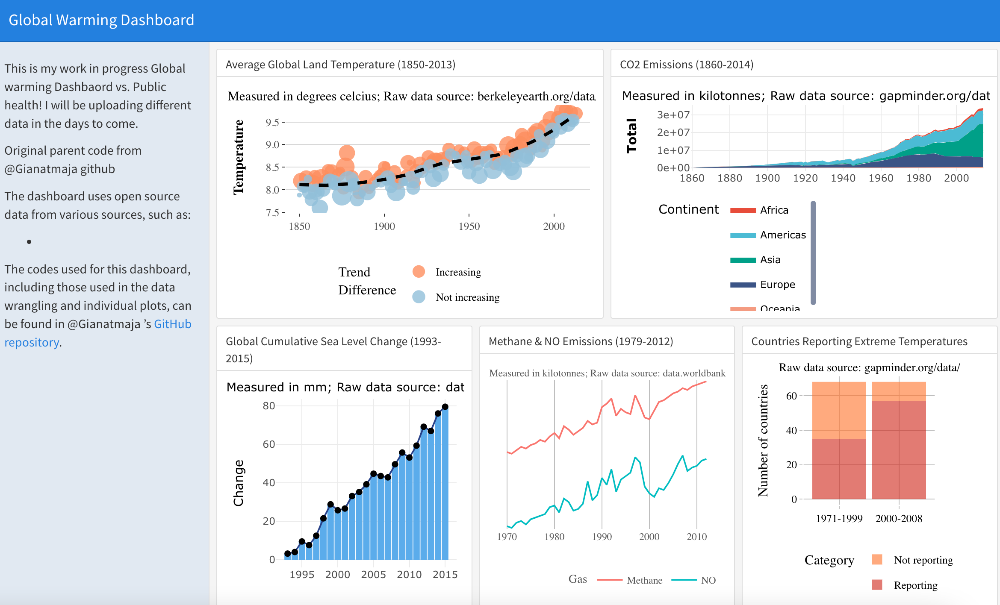

# Global Warming Dashboard

### Quic Links  
- [View dashboard on Rpubs](file:///Users/jasminemerrill/Global%20Warming%20Dashboard/GlobalWarmingDashboardJ.html)  
  
### Description
An informative dashboard on global warming, made using R's ggplot2, plotly, and flexdashboard.

### Datasets & Source of Data
Datasets:  
- [AverageGlobalTemp.txt](https://github.com/Gianatmaja/Global-Warming-Dashboard/blob/master/AverageGlobalTemp.txt)
- [CO2_Emissions.csv](https://github.com/Gianatmaja/Global-Warming-Dashboard/blob/master/CO2_Emissions.csv)
- [Sea_level_GMSL.csv](https://github.com/Gianatmaja/Global-Warming-Dashboard/blob/master/Sea_level_GMSL.csv)
- [Methane_Emissions.csv](https://github.com/Gianatmaja/Global-Warming-Dashboard/blob/master/Methane_Emissions.csv)
- [NO_Emissions.csv](https://github.com/Gianatmaja/Global-Warming-Dashboard/blob/master/NO_Emissions.csv)
- [Extreme_temp.csv](https://github.com/Gianatmaja/Global-Warming-Dashboard/blob/master/Extreme_temp.csv)

Source of Data:  
- [Berkeley Earth](http://berkeleyearth.org/data/)
- [Gapminder](https://www.gapminder.org/data/)
- [Datahub](https://datahub.io/)
- [World Bank Open Data](https://data.worldbank.org/)

### R Packages Used: 
- Data Wrangling: dplyr, tibble, countrycode, tidyr
- Data Visualisation: ggplot2, ggthemes, plotly, viridis, RColorBrewer, ggsci
- Dashboard: flexdashboard 
